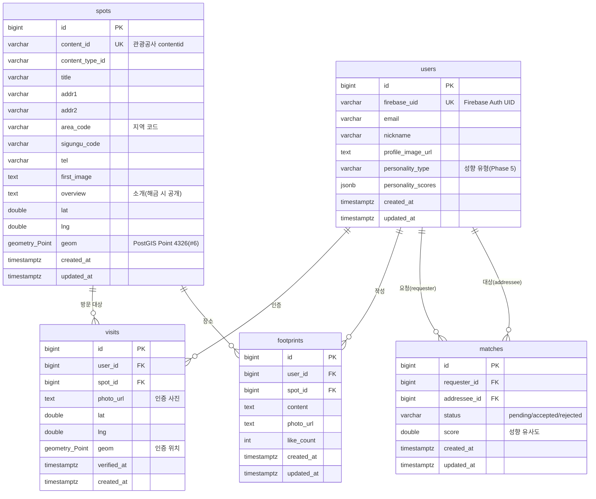

# 🗄️ FogApp 데이터베이스 ERD

> 스키마 원본(정본)은 [server/src/main/resources/db/migration/V1__init_schema.sql](../server/src/main/resources/db/migration/V1__init_schema.sql) 입니다.
> 이 문서는 그 마이그레이션을 사람이 읽기 쉽게 정리한 것입니다. 관련 이슈: #1

## 관계도

## 테이블 요약

| 테이블 | 역할 | 주요 사용 Phase |
|--------|------|-----------------|
| `users` | 사용자 프로필 + 여행 성향 결과 자리 | 1(인증), 5(매칭) |
| `spots` | 관광공사 스팟(안개 아래 탐험 포인트), PostGIS 좌표 | 1(수집), 2(지도), 3(인증) |
| `visits` | 방문 인증 기록(사진 → 안개 해제) | 3 |
| `footprints` | 발자취(텍스트·사진 기록) — 뼈대 | 4 |
| `matches` | 성향 매칭(동행) — 뼈대 | 5 |

## 설계 노트

- **좌표 저장**: 원본 위경도(`lat`/`lng`)를 그대로 두고, PostGIS 연산용 `geom geometry(Point, 4326)`를 별도로 둔다.
  `geom`은 [#6](../../issues/6)에서 `lat`/`lng` 로부터 채우고 GiST 인덱스(`idx_spots_geom`)로 반경 검색을 가속한다.
- **정복 규칙**: `visits (user_id, spot_id)` 유니크 → 한 사용자당 스팟 1회 정복.
- **중복 적재 방지**: `spots.content_id` 유니크 → OpenAPI 재수집([#5](../../issues/5)) 시 중복 방지.
- **성향 자리**: `users.personality_type` / `personality_scores(jsonb)` 는 Phase 5 전까지 비워둔다.
- **스키마 소유권**: Flyway 가 스키마를 소유하고(`db/migration/V*.sql`), Hibernate 는 `ddl-auto: validate` 로 엔티티 일치만 검증한다.

## 검증

로컬 PostGIS(`docker compose up -d`)에 V1 마이그레이션을 적용해
테이블·`geometry(Point,4326)`·GiST 인덱스 생성과 `ST_DWithin` 반경 쿼리·FK 동작을 확인했다.
