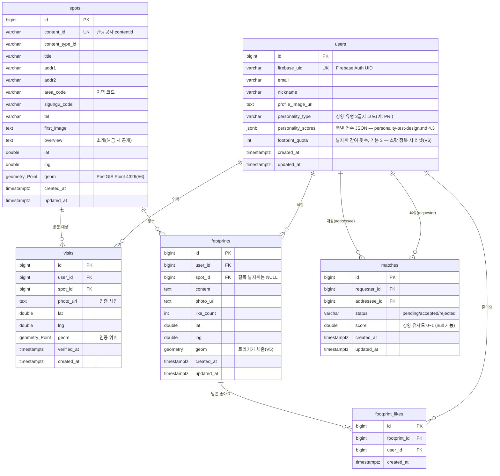

# 🗄️ FogApp 데이터베이스 ERD

> 스키마 원본(정본)은 `server/src/main/resources/db/migration/` 의 Flyway 마이그레이션입니다.
> 이 문서는 그 마이그레이션을 사람이 읽기 쉽게 정리한 것입니다.

| 버전 | 내용 | 이슈 |
|------|------|------|
| [V1__init_schema.sql](../server/src/main/resources/db/migration/V1__init_schema.sql) | 초기 스키마 — `users` · `spots` · `visits` · `footprints` · `matches` + PostGIS 확장 | [#1](https://github.com/FogMap2026/FogApp/issues/1) |
| [V2__spot_geom_autofill.sql](../server/src/main/resources/db/migration/V2__spot_geom_autofill.sql) | `spots.geom` 자동 채움 트리거 + 좌표 이상치 처리 | [#6](https://github.com/FogMap2026/FogApp/issues/6) |
| [V3__footprint_likes.sql](../server/src/main/resources/db/migration/V3__footprint_likes.sql) | `footprint_likes` 테이블 (발자취 좋아요·공감) | [#23](https://github.com/FogMap2026/FogApp/issues/23) |
| [V4__visit_geom_autofill.sql](../server/src/main/resources/db/migration/V4__visit_geom_autofill.sql) | `visits.geom` 자동 채움 트리거 (V1에서 컬럼만 있고 채우는 주체가 없었다) | [#48](https://github.com/FogMap2026/FogApp/issues/48) |
| [V5__footprint_geo.sql](../server/src/main/resources/db/migration/V5__footprint_geo.sql) | `footprints` 좌표·`geom`·GiST 인덱스 + 트리거, 기존 행 보정 | [#114](https://github.com/FogMap2026/FogApp/issues/114) |
| [V6__footprint_quota.sql](../server/src/main/resources/db/migration/V6__footprint_quota.sql) | `users.footprint_quota` (발자취 잔여 횟수, 기본 3 · 스팟 정복 시 리셋) | [#116](https://github.com/FogMap2026/FogApp/issues/116) |

> ✅ **`footprints`에 좌표가 추가됐습니다**([#114](https://github.com/FogMap2026/FogApp/issues/114), V5).
> 발자취가 스팟 리뷰에서 **길목마다 남기는 글귀**로 재설계되면서 `lat`·`lng`·`geom`(GiST 인덱스)이
> 붙었습니다. `geom`은 `spots`(V2)·`visits`(V4)와 같이 **DB 트리거가 채웁니다.**
>
> 기존 행은 **연결된 스팟 좌표로 소급해 채웠습니다** — 그대로 두면 지도에서 통째로 사라집니다.
>
> ✅ **`users.footprint_quota` 도 들어갔습니다**([#116](https://github.com/FogMap2026/FogApp/issues/116), V6).
> 발자취 작성 횟수를 제한하고 **스팟을 정복하면 리셋**합니다 — 도배 방지와 탐험 유도를 한 장치로 해결합니다.
> 기본값 3 이고, 기존 사용자에게도 소급 적용됐습니다. 설계 근거와 값은 [footprint-redesign.md](footprint-redesign.md) 참고.
>
> ⚠️ **반경 조회가 아직 GiST 인덱스를 못 탑니다** — `geom`(geometry)에 인덱스를 걸고 쿼리는
> `geom::geography` 로 물어봐 타입이 어긋납니다(48.4ms → 4.6ms). `spots`·`footprints` 둘 다
> 해당하며 [#125](https://github.com/FogMap2026/FogApp/issues/125)(`V7__geography_indexes.sql`)에서 함께 고칩니다.

## 관계도

```mermaid
erDiagram
    users      ||--o{ visits          : "인증"
    users      ||--o{ footprints      : "작성"
    users      ||--o{ matches         : "요청(requester)"
    users      ||--o{ matches         : "대상(addressee)"
    users      ||--o{ footprint_likes : "좋아요"
    spots      ||--o{ visits          : "방문 대상"
    spots      ||--o{ footprints      : "장소"
    footprints ||--o{ footprint_likes : "받은 좋아요"

    users {
        bigint      id PK
        varchar     firebase_uid UK "Firebase Auth UID"
        varchar     email
        varchar     nickname
        text        profile_image_url
        varchar     personality_type  "성향 유형 3글자 코드(예: PRI)"
        jsonb       personality_scores "축별 점수 JSON — personality-test-design.md 4.3"
        int         footprint_quota   "발자취 잔여 횟수, 기본 3 — 스팟 정복 시 리셋(V6)"
        timestamptz created_at
        timestamptz updated_at
    }

    spots {
        bigint          id PK
        varchar         content_id UK "관광공사 contentid"
        varchar         content_type_id
        varchar         title
        varchar         addr1
        varchar         addr2
        varchar         area_code "지역 코드"
        varchar         sigungu_code
        varchar         tel
        text            first_image
        text            overview "소개(해금 시 공개)"
        double          lat
        double          lng
        geometry_Point  geom "PostGIS Point 4326(#6)"
        timestamptz     created_at
        timestamptz     updated_at
    }

    visits {
        bigint          id PK
        bigint          user_id FK
        bigint          spot_id FK
        text            photo_url "인증 사진"
        double          lat
        double          lng
        geometry_Point  geom "인증 위치"
        timestamptz     verified_at
        timestamptz     created_at
    }

    footprints {
        bigint      id PK
        bigint      user_id FK
        bigint      spot_id FK "길목 발자취는 NULL"
        text        content
        text        photo_url
        int         like_count
        double      lat
        double      lng
        geometry    geom "트리거가 채움(V5)"
        timestamptz created_at
        timestamptz updated_at
    }

    matches {
        bigint      id PK
        bigint      requester_id FK
        bigint      addressee_id FK
        varchar     status "pending/accepted/rejected"
        double      score "성향 유사도 0~1 (null 가능)"
        timestamptz created_at
        timestamptz updated_at
    }

    footprint_likes {
        bigint      id PK
        bigint      footprint_id FK
        bigint      user_id FK
        timestamptz created_at
    }
```

## 테이블 요약

| 테이블 | 역할 | 상태 | 사용 위치 |
|--------|------|------|-----------|
| `users` | 사용자 프로필 + 여행 성향 결과 | ✅ 사용 중 | `/api/profile`, 매칭 |
| `spots` | 관광공사 스팟(안개 아래 탐험 포인트), PostGIS 좌표 | ✅ 사용 중 | 수집 배치, `/api/spots` |
| `visits` | 방문 인증 기록(사진 → 안개 해제) | ⬜ 테이블만 존재 | Phase 3(3-4)에서 사용 예정 |
| `footprints` | 발자취(텍스트·사진 기록) | ✅ 사용 중 | `/api/footprints` |
| `matches` | 성향 매칭(동행) 요청·상태 | ✅ 사용 중 | `/api/matches` |
| `footprint_likes` | 발자취 좋아요·공감 (1인 1회) | ✅ 사용 중 | `/api/footprints/{id}/likes` |

## 설계 노트

- **좌표 저장**: 원본 위경도(`lat`/`lng`)를 그대로 두고, PostGIS 연산용 `geom geometry(Point, 4326)`를 별도로 둔다.
  `geom`은 **DB 트리거**(`trg_spots_set_geom`, V2)가 `lat`/`lng`로부터 자동으로 채우고, GiST 인덱스(`idx_spots_geom`)로 반경 검색을 가속한다.
  애플리케이션이 아니라 DB에 둔 이유는, 수집 배치([#5](https://github.com/FogMap2026/FogApp/issues/5))가 JPA 엔티티 콜백을 타지 않는 경로로 적재해도 `geom` 누락이 생기지 않게 하기 위해서다.
- **좌표 이상치**: `lat`/`lng`가 NULL이거나 범위를 벗어나면 행은 남기고 `geom`만 NULL로 둔다 → 반경 검색에서 자연히 제외된다.
- **정복 규칙**: `visits (user_id, spot_id)` 유니크 → 한 사용자당 스팟 1회 정복.
- **중복 적재 방지**: `spots.content_id` 유니크 → OpenAPI 재수집([#5](https://github.com/FogMap2026/FogApp/issues/5)) 시 업서트로 중복 방지.
- **좋아요 중복 방지**: `footprint_likes (footprint_id, user_id)` 유니크 → 1인 1회.
  `footprints.like_count`는 이 테이블 기준의 **캐시 카운트**이므로, 좋아요 등록·취소 시 반드시 함께 갱신한다.
- **성향 저장**: `users.personality_type`(3글자 코드) / `personality_scores(jsonb)`.
  포맷 정의는 [personality-test-design.md](personality-test-design.md) 4.3 참고. `PATCH /api/profile/personality`로 저장된다.
- **스키마 소유권**: Flyway 가 스키마를 소유하고(`db/migration/V*.sql`), Hibernate 는 `ddl-auto: validate` 로 엔티티 일치만 검증한다.
  **스키마 변경은 항상 새 `V{n}__*.sql` 파일 추가로만** 한다 (기존 파일 수정 금지 — 체크섬 불일치로 기동 실패).

## 검증

로컬 PostGIS(`docker compose up -d`)에 V1~V6 마이그레이션을 적용해
테이블·`geometry(Point,4326)`·GiST 인덱스 생성과 `ST_DWithin` 반경 쿼리·FK 동작을 확인했다.

CI와 서버 통합 테스트(`*IT.java`)는 **Testcontainers**로 PostGIS 컨테이너를 띄워
마이그레이션 적용과 쿼리 동작을 매 빌드마다 재검증한다.
